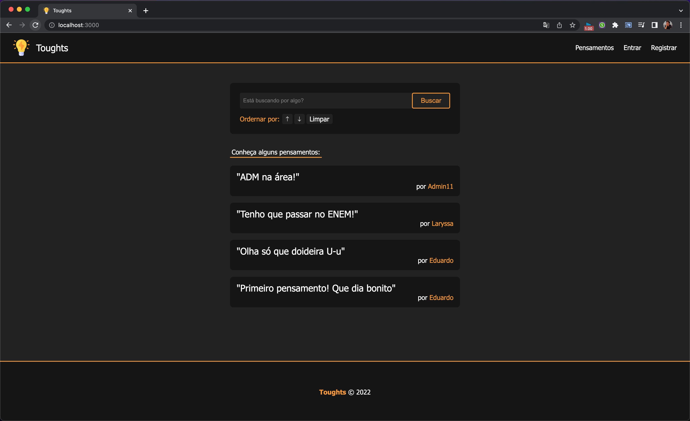
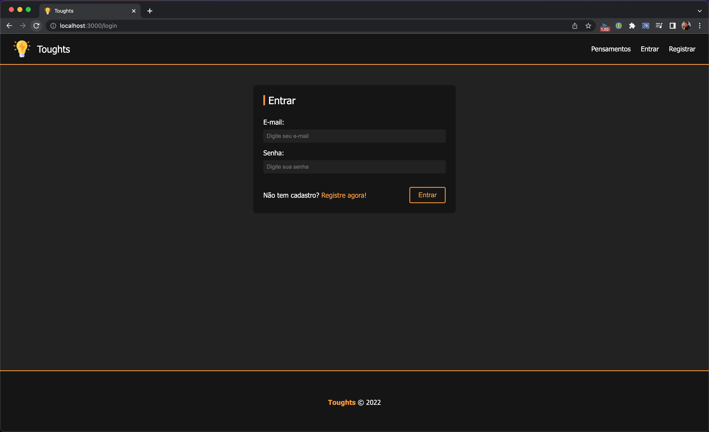
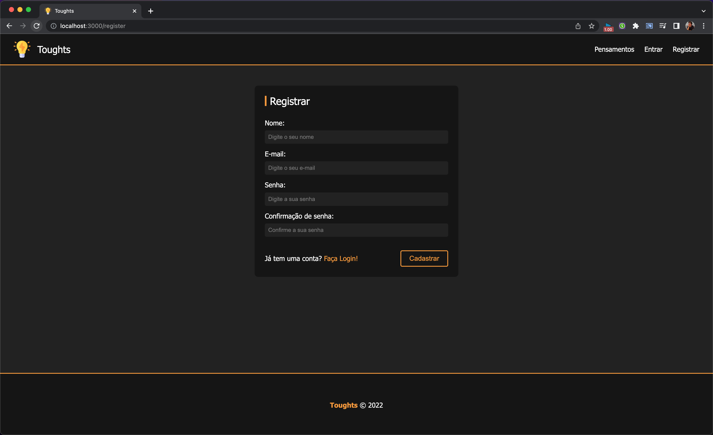
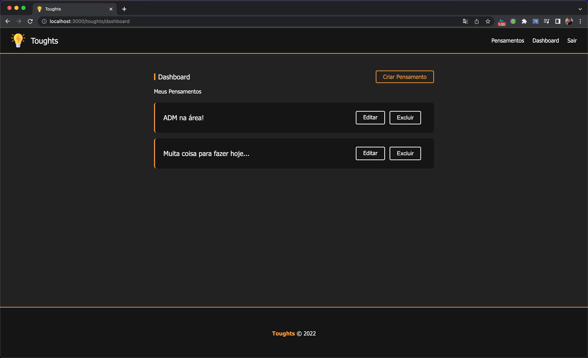

# Toughts - Node.JS
[](#) 

## 📸 Preview

<p align="center">
  
</p>

## 📝 **Descrição**

O Toughts é uma micro rede social para pessoas compartilharem e buscarem pensamentos publicamente. Com base nessa ideia, foi criado uma aplicação web usando Node.JS, Express, Sequelize (MySQL) e Handlebars para implementar as funcionalidades. 

## 🚀 **Objetivo**

Esse projeto foi criado com o objetivo de se desenvolver uma aplicação web simples que permita o usuário se cadastrar em uma micro rede social para publicar e interagir com postagens chamadas de "pensamentos". Esse sistema possui a função de registro e login de usuários. Quando logado, permite a publicação, edição e exclusão de pensamentos próprios. Além da visualização e pesquisa de postagens para qualquer usuário (logado e não logado). Apesar de simples, o projeto tem o objetivo principal de explorar tecnologias básicas no desenvolvimento backend com Node.JS. Utilizando o [Express](https://expressjs.com/pt-br/) como framework principal, [Sequelize](https://sequelize.org/) como ORM de MySQL e  [Handlebars](https://handlebarsjs.com/) para renderização do frontend. Além disso, foi levado em conta requisitos básicos de segurança (Criptografia de senhas e otimização das sessões) para implementar o Toughts.

## 📌 Nota importante!
Essa aplicação foi baseada no projeto do curso "Node.js do Zero a Maestria com diversos Projetos" da plataforma Udemy. Porém, foi alterado para não se limitar ao conteúdo das aulas. Ou seja, o projeto desse repositório é uma versão melhorada e completa da ideia inicial do Toughts proposta pelo curso. Com mais features e libs extras, além de possuir alguns toques especiais meus.

## ✅ Features Funcionais
- Exibição de pensamentos na home
- Filtros de busca e ordem de publicação
- Registro de usuários com criptografia de senha
- Login e logout de usuários cadastrados
- Dashboard para controle dos pensamentos publicados pelo usuário
- Criação, edição e remoção de pensamentos do usuário

## 🔎 Teste Você Mesmo
📌 **Pré requisitos:**
1. Tenha o repositório baixado em sua máquina.
2. Tenha o [NodeJS](https://nodejs.org/) instalado em sua máquina.
3. Tenha o [MySQL](https://www.mysql.com/) instalado em sua máquina.
4. Crie um banco de dados mysql localmente chamado *nodetoughts*. Não se preocupe com as tabelas.


🚩 **Como Executar:**
1. Com o terminal aberto no diretório do projeto, execute o comando `npm install` para instalar as dependências.
2. Após a instalação, crie e configure um arquivo ```.env``` seguindo o ```.env.exemple```, informando os dados do seu ambiente nos campos solicitados.
3. Para executar o projeto, use o comando `npm start`


## 📸 Preview das Telas

<p align="center">
  
  
  
  
</p>
   


